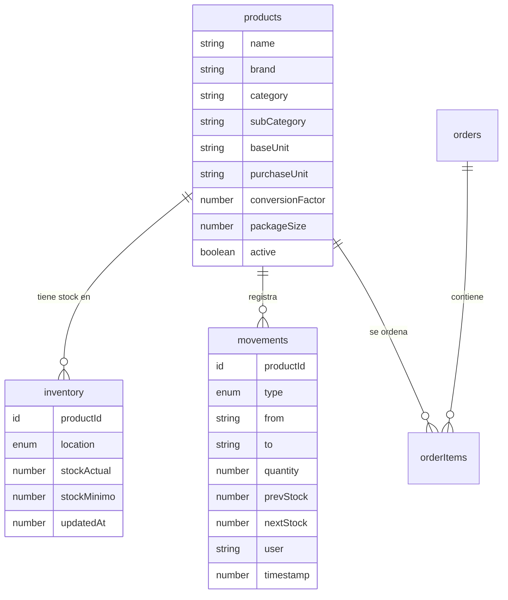

# Refactorizacion del Esquema de Inventario

## Arquitectura Propuesta



## Fase 1: Actualizar Schema

Modificar [`convex/schema.ts`](convex/schema.ts):

1. **Agregar nuevas tablas**: `products`, `inventory`, `movements`
2. **Mantener tablas existentes**: `items`, `stock_movements`, `orders`, `orderItems` (coexistencia para transicion gradual)
3. Mantener tablas de mantenimiento sin cambios (`activos`, `repuestos`, etc.)

Campos clave del nuevo esquema:

```typescript
// products - Catalogo maestro
products: defineTable({
  name: v.string(),
  brand: v.string(),
  category: v.string(),
  subCategory: v.optional(v.string()),
  baseUnit: v.string(),        // unidad minima (lata, gr, ml)
  purchaseUnit: v.string(),    // como se compra (caja, fardo)
  conversionFactor: v.number(), // baseUnits por purchaseUnit
  packageSize: v.number(),
  active: v.boolean(),
}).index("by_name", ["name"])

// inventory - Stock por ubicacion
inventory: defineTable({
  productId: v.id("products"),
  location: v.union(v.literal("almacen"), v.literal("cafetin")),
  stockActual: v.number(),     // SIEMPRE en baseUnit
  stockMinimo: v.number(),
  updatedAt: v.number(),
}).index("by_location", ["location"])
  .index("by_product_location", ["productId", "location"])

// movements - Auditoria
movements: defineTable({
  productId: v.id("products"),
  type: v.union(
    v.literal("COMPRA"),
    v.literal("TRASLADO"),
    v.literal("CONSUMO"),
    v.literal("AJUSTE")
  ),
  from: v.optional(v.string()),
  to: v.string(),
  quantity: v.number(),
  prevStock: v.number(),
  nextStock: v.number(),
  user: v.string(),
  timestamp: v.number(),
}).index("by_product", ["productId"])
```

## Fase 2: Crear Script de Migracion

Crear [`convex/migration.ts`](convex/migration.ts) con mutaciones para:

1. `migrateItemsToProducts`: Convertir cada `item` a un `product`

   - Mapear: `nombre` -> `name`, `marca` -> `brand`, `categoria` -> `category`
   - **Usar valor actual de `unidad` para `baseUnit`** (no valores default)
   - Establecer valores iniciales: `purchaseUnit` = valor de `unidad` actual, `conversionFactor=1`

2. `migrateInventory`: Crear registros de `inventory`

   - Usar `location` del item original para determinar ubicacion
   - Migrar `stock_actual` -> `stockActual`, `stock_minimo` -> `stockMinimo`

3. `migrateMovements`: Convertir `stock_movements` a nuevo formato

   - `ingreso` + `compra` -> `COMPRA`
   - `egreso` + `consumo` -> `CONSUMO`
   - `ajuste` -> `AJUSTE`

4. `migrateOrderItems`: Actualizar referencias de `itemId` a `productId`

## Fase 3: Crear Nuevas Funciones Convex (Paralelas)

Crear nuevos archivos sin eliminar los existentes (coexistencia):

| Archivo Nuevo | Descripcion |

|---------------|-------------|

| [`convex/products.ts`](convex/products.ts) | Nuevas funciones para productos (paralelo a items.ts) |

| [`convex/inventory.ts`](convex/inventory.ts) | Funciones para gestionar stock por ubicacion |

| [`convex/movements.ts`](convex/movements.ts) | Nuevas funciones de movimientos (paralelo a stockMovements.ts) |

**Mantener archivos existentes funcionando**:

- [`convex/items.ts`](convex/items.ts) - Seguira funcionando con tabla `items`
- [`convex/stockMovements.ts`](convex/stockMovements.ts) - Seguira funcionando con tabla `stock_movements`
- [`convex/orders.ts`](convex/orders.ts) - Seguira usando `itemId` por ahora

Nuevas funciones clave:

```typescript
// products.ts
export const list = query(...)              // Listar productos
export const getById = query(...)           // Obtener producto
export const create = mutation(...)         // Crear producto

// inventory.ts (nuevo archivo)
export const getByLocation = query(...)     // Stock por ubicacion
export const getByProduct = query(...)      // Stock de un producto en todas las ubicaciones
export const updateStock = mutation(...)    // Actualizar stock (crea movement)
export const transfer = mutation(...)       // TRASLADO entre ubicaciones

// movements.ts (renombrar stockMovements.ts)
export const registerCompra = mutation(...) // Entrada de proveedor
export const registerConsumo = mutation(...) // Uso/venta
export const registerAjuste = mutation(...) // Correccion manual
```

## Fase 4: Actualizar Frontend (Opcional - Transicion Gradual)

**Nota**: Durante la transicion, el frontend puede seguir usando las APIs antiguas (`items`, `stock_movements`) mientras se migran gradualmente a las nuevas.

Componentes que eventualmente se actualizaran:

- [`src/app/admin/inventario/page.tsx`](src/app/admin/inventario/page.tsx) - Vista principal
- [`src/app/admin/inventario/editor/page.tsx`](src/app/admin/inventario/editor/page.tsx) - Editor de items
- [`src/components/admin/ItemsEditor/*.tsx`](src/components/admin/ItemsEditor/) - Componentes del editor
- [`src/app/admin/movements/`](src/app/admin/movements/) - Pagina de movimientos

**Estrategia de migracion frontend**:

- Mantener componentes actuales funcionando con APIs antiguas
- Crear versiones nuevas que usen `products`/`inventory`/`movements`
- Migrar gradualmente componente por componente

## Configuracion Long-Running Agent Loop

Basado en [Cursor Agent Best Practices](https://cursor.com/blog/agent-best-practices), configuraremos un loop de agente que itera hasta completar todas las fases.

### Archivo de Progreso: `.cursor/scratchpad.md`

El agente usara este archivo para trackear progreso y decidir si continuar:

```markdown
# Refactor Inventory Schema - Progress

## Phases
- [ ] PHASE_1_SCHEMA: Actualizar schema.ts con nuevas tablas
- [ ] PHASE_2_CONVEX_DEV: Ejecutar npx convex dev y verificar sin errores
- [ ] PHASE_3_MIGRATION: Crear convex/migration.ts
- [ ] PHASE_4_PRODUCTS: Crear convex/products.ts
- [ ] PHASE_5_INVENTORY: Crear convex/inventory.ts  
- [ ] PHASE_6_MOVEMENTS: Crear convex/movements.ts
- [ ] PHASE_7_RUN_MIGRATION: Ejecutar migracion de datos reales
- [ ] PHASE_8_VERIFY: Verificar que nuevas APIs funcionan

## Current Phase
PHASE_1_SCHEMA

## Notes
(Agent writes observations here)

## DONE
(Write DONE here when all phases complete)
```

### Hook de Continuacion: `.cursor/hooks.json`

```json
{
  "version": 1,
  "hooks": {
    "stop": [{ "command": "bun run .cursor/hooks/schema-refactor.ts" }]
  }
}
```

### Script del Hook: `.cursor/hooks/schema-refactor.ts`

```typescript
import { readFileSync, existsSync } from "fs";

interface StopHookInput {
  conversation_id: string;
  status: "completed" | "aborted" | "error";
  loop_count: number;
}

const input: StopHookInput = await Bun.stdin.json();
const MAX_ITERATIONS = 10;

if (input.status !== "completed" || input.loop_count >= MAX_ITERATIONS) {
  console.log(JSON.stringify({}));
  process.exit(0);
}

const scratchpad = existsSync(".cursor/scratchpad.md")
  ? readFileSync(".cursor/scratchpad.md", "utf-8")
  : "";

if (scratchpad.includes("## DONE") && scratchpad.split("## DONE")[1].includes("DONE")) {
  console.log(JSON.stringify({}));
} else {
  // Find next incomplete phase
  const phases = [
    "PHASE_1_SCHEMA",
    "PHASE_2_CONVEX_DEV", 
    "PHASE_3_MIGRATION",
    "PHASE_4_PRODUCTS",
    "PHASE_5_INVENTORY",
    "PHASE_6_MOVEMENTS",
    "PHASE_7_RUN_MIGRATION",
    "PHASE_8_VERIFY"
  ];
  
  const currentPhase = phases.find(p => scratchpad.includes(`- [ ] ${p}`)) || "UNKNOWN";
  
  console.log(JSON.stringify({
    followup_message: `[Iteration ${input.loop_count + 1}/${MAX_ITERATIONS}] Continue with ${currentPhase}. Mark phases complete with [x] in scratchpad. Write DONE in ## DONE section when all phases complete.`
  }));
}
```

## Orden de Ejecucion (Agent Loop)

### PHASE_1_SCHEMA

Actualizar `convex/schema.ts`:

- Agregar tablas `products`, `inventory`, `movements`
- Mantener tablas existentes (`items`, `stock_movements`, etc.)
- Marcar `[x] PHASE_1_SCHEMA` en scratchpad

### PHASE_2_CONVEX_DEV

Ejecutar `npx convex dev`:

- Verificar que el schema se aplica sin errores
- Si hay errores, corregir y reintentar
- Marcar `[x] PHASE_2_CONVEX_DEV` en scratchpad

### PHASE_3_MIGRATION

Crear `convex/migration.ts`:

- `migrateItemsToProducts`: items -> products (usar `unidad` como `baseUnit`)
- `migrateInventory`: crear registros de inventory
- `migrateMovements`: stock_movements -> movements
- Marcar `[x] PHASE_3_MIGRATION` en scratchpad

### PHASE_4_PRODUCTS

Crear `convex/products.ts`:

- `list`, `getById`, `create`, `update`, `toggleActive`
- Queries para buscar por nombre, categoria
- Marcar `[x] PHASE_4_PRODUCTS` en scratchpad

### PHASE_5_INVENTORY

Crear `convex/inventory.ts`:

- `getByLocation`, `getByProduct`, `getAll`
- `updateStock`, `transfer` (TRASLADO entre ubicaciones)
- Marcar `[x] PHASE_5_INVENTORY` en scratchpad

### PHASE_6_MOVEMENTS

Crear `convex/movements.ts`:

- `registerCompra`, `registerConsumo`, `registerTraslado`, `registerAjuste`
- `getByProduct`, `getRecent`
- Marcar `[x] PHASE_6_MOVEMENTS` en scratchpad

### PHASE_7_RUN_MIGRATION

Ejecutar migracion:

- Llamar mutaciones de migracion via dashboard o script
- Verificar datos migrados correctamente
- Marcar `[x] PHASE_7_RUN_MIGRATION` en scratchpad

### PHASE_8_VERIFY

Verificar implementacion:

- Probar queries de products, inventory, movements
- Verificar que datos existen en nuevas tablas
- Marcar `[x] PHASE_8_VERIFY` en scratchpad
- Escribir `DONE` en seccion `## DONE`

## Criterios de Exito por Fase

| Fase | Verificacion |

|------|-------------|

| PHASE_1 | `npx convex dev` compila sin errores de schema |

| PHASE_2 | Convex dashboard muestra nuevas tablas |

| PHASE_3 | Archivo `migration.ts` existe con todas las mutaciones |

| PHASE_4 | Archivo `products.ts` existe con queries/mutations |

| PHASE_5 | Archivo `inventory.ts` existe con operaciones de stock |

| PHASE_6 | Archivo `movements.ts` existe con registro de auditoría |

| PHASE_7 | Tablas `products`, `inventory` tienen datos migrados |

| PHASE_8 | Queries retornan datos correctos |

## Notas

- **No se actualizara seed.ts** - se usaran datos reales migrados
- **Frontend sin cambios** - seguira usando APIs antiguas
- El agente debe actualizar `scratchpad.md` despues de cada fase completada